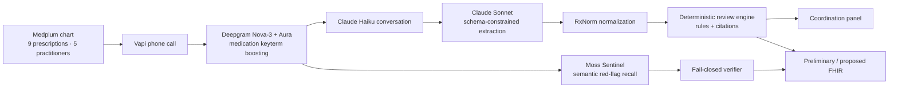

<div align="center">

# Deprescribe

### One medication story. One coordinated review.

Deprescribe is a TypeScript/Node.js agentic healthcare workflow that combines a synthetic patient's Medplum chart with one voice interview, reconciles what the chart says with what the patient reports, and prepares evidence-linked FHIR review artifacts for the authorized care team.

Built for the **YC × Medplum Agentic Healthcare Hackathon**.


</div>

## The thesis

**Three medications. One potential root cause.**

An older adult may receive amlodipine for blood pressure, then furosemide after ankle swelling, then allopurinol after gout. Each prescription can look reasonable in isolation. The medication story becomes visible only when the chart, the patient's chronology, and every prescriber are reviewed together.

Deprescribe gives the patient one conversation and gives clinicians one independently checkable review. It does not diagnose, establish causality, or order medication changes.

## Headline result

The checked-in synthetic regression fixture produces:

| Proof point | Validated result |
|---|---:|
| Active prescriptions loaded from Medplum | **9** |
| Fictional practitioners represented | **5** |
| Anticholinergic Cognitive Burden | **8** |
| Potential findings in the engine fixture | **12** |
| Hero chain | **amlodipine → furosemide → allopurinol** |
| Clean negative control | **0 findings, ACB 0** |

These are deterministic fixture results, not clinical outcomes. Findings are potential review items whose citations and patient-reported supporting history remain visible to a clinician.

## The loop



The chart is loaded before the call. Current medications are passed to Vapi as presentation-safe dynamic variables, so the patient confirms known medicines and fills gaps instead of repeating an inventory from scratch. After the call, structured extraction and RxNorm resolution feed the deterministic clinical engine. The panel and FHIR resources show what the chart knew, what the patient added or contradicted, and what the care team may want to review.

Sentinel is a separate urgent-safety seam. Lexical checks always run first. With `MOSS_MODE=on`, Moss adds semantic red-flag candidates from natural patient language; a closed, quote-checked verifier must confirm a candidate before an evidence-bearing `Flag` is written. Failures fall back to the lexical baseline.

## Why it is a strong agentic healthcare workflow

- **Patient-centered:** one call captures medication use, gaps, symptoms, concerns, and the patient's priorities.
- **Clinician-enhancing:** the agent prepares a ranked, cited coordination artifact; clinicians retain the decision and prescribing authority.
- **Standards-based:** chart input and review output use Medplum and FHIR R4 resources rather than a parallel proprietary record.
- **Independently checkable:** clinical detection is a versioned rule table with source citations, while the negative control proves the engine can return nothing.

## Architecture

| Layer | Stack | Role |
|---|---|---|
| Longitudinal record | Medplum, FHIR R4 | Patient, practitioner, condition, and medication history; scoped synthetic write-back |
| Conversation | Vapi, Claude Haiku | Outbound call orchestration and short, chart-prefilled interview turns |
| Speech | Deepgram Nova-3 and Aura through Vapi | Transcription and speech, with medication and safety keyterm boosting |
| Structured understanding | Claude Sonnet | Schema-constrained extraction and explanation; no clinical rule selection |
| Identity | RxNorm / RxNav | Normalize newly reported products to medication identity, with explicit unresolved states |
| Semantic safety recall | Moss Sentinel | Opt-in, in-process red-flag candidate retrieval; never reads a similarity score as confidence |
| Clinical review | TypeScript rule engine | 12 PIM rules, 8 prescribing cascades, 3 duplicate classes, and ACB scoring |
| Coordination | Server-rendered panel, Medplum writers | Presentation-safe review plus retry-safe FHIR artifacts |

The central separation is deliberate: conversational AI understands language; `src/engine/detect.ts` makes no LLM calls. Medication findings come from deterministic clinical rules and citations.

## What it proves

| Judge question | Repository answer |
|---|---|
| Does the call know the chart first? | `loadChartContext` reads the linked patient before Vapi receives compact per-call dynamic variables. |
| Is an LLM deciding which medication is unsafe? | No. Claude extracts structured facts; the deterministic engine selects medication review findings. |
| Can one call write to the wrong patient? | Patient-specific writes require the stored call session and an explicitly synthetic, tagged Medplum patient. Unlinked calls are panel-only. |
| What happens after a partial write failure? | Stable call-scoped identifiers and typed Medplum lookup update existing resources on retry instead of duplicating them. |
| Can prior agent output contaminate the next review? | Every generated resource carries the canonical `review-output` tag and is excluded from later chart prefill. |
| Can it be checked without sponsor credentials? | The canned panel, engine fixture, negative control, FHIR stubs, server routes, and Sentinel-off invariants all run offline. |

## Integrations

| Integration | Role | Honest status |
|---|---|---|
| **Medplum** | FHIR-native chart read, synthetic patient linkage, and review-resource write-back | Implemented; live use requires a ClientApplication |
| **Deepgram through Vapi** | Nova-3 transcription and Aura speech; medication/safety keyterm boosting | Implemented in the versioned Vapi assistant configuration |
| **Vapi** | Outbound calls, chart-prefill variables, authenticated transcript and end-of-call webhooks | Implemented; live use requires Vapi IDs and credentials |
| **Anthropic** | Claude Haiku for the live conversation/verifier; Claude Sonnet for schema-constrained extraction and explanation | Implemented; offline tests do not call the API |
| **RxNorm / RxNav** | Medication normalization and resolution | Implemented with explicit unresolved/fallback behavior |
| **Moss** | Sentinel semantic recall for indirect urgent red-flag phrasing | Integrated and opt-in (`off`, `shadow`, `on`); offline fail-safe tests are included, live measurement requires Moss credentials |
| **Stedi** | Future coverage and medication-cost context | Planned, not integrated and not represented as product output |

## Run it

### Offline canned path first

```bash
npm ci
npm run panel:canned
npm run server
```

Open `http://127.0.0.1:3001/review`. The page is explicitly labeled as canned and makes no Medplum, Vapi, Anthropic, RxNav, or Moss request.

### Credentialed live-call path

Configure the environment using [the setup guide](docs/SETUP.md). To enable Sentinel, provide `MOSS_PROJECT_ID` and `MOSS_PROJECT_KEY`, then set `MOSS_MODE=on` (`shadow` retrieves candidates without adding semantic escalations).

```bash
npm run seed
npm run server
npx localtunnel --port 3000

# In another terminal, after setting PUBLIC_VAPI_ORIGIN:
npm run vapi:setup -- "$PUBLIC_VAPI_ORIGIN/vapi"
npm run demo:call
npm run demo:inspect
```

The canonical sequence, role-play, inspection checklist, fallback, and privacy rules are in the [cross-prescriber operator runbook](docs/DEMO_CROSS_PRESCRIBER.md).

## Validated numbers

| Surface | Current count / assertion |
|---|---|
| Potentially inappropriate medication rules | **12** |
| Prescribing-cascade rules | **8** |
| Therapeutic-duplication classes | **3** |
| Seeded chart | **1 patient · 5 practitioners · 5 conditions · 9 active MedicationRequests** |
| Engine fixture | **ACB 8 · 12 findings · hero three-drug chain** |
| Negative control | **0 findings · ACB 0** |
| Sentinel offline fixtures | **54 utterances; lexical behavior unchanged when Moss is off** |

```bash
npm test
npm run typecheck

# Optional credentialed Sentinel evaluation/demo:
npm run sentinel:measure
npm run sentinel:try -- "I went down in the bathroom and cracked my head on the tub"
```

## Clinical evidence and limits

These publications establish clinical context; they are not Deprescribe outcomes:

- A population cohort found that older adults newly prescribed a calcium-channel blocker were more likely to receive a loop diuretic within 90 days (HR 2.51, 95% CI 2.13–2.96), the measured cascade represented by the fixture. [Savage et al., JAMA Internal Medicine (2020)](https://doi.org/10.1001/jamainternmed.2019.7087)
- In a 130-person STOPPFrail randomized trial, the intervention group reduced medication count and monthly medication cost; the trial did not detect significant differences in falls, hospitalization, quality of life, or mortality. [Curtin et al., Journal of the American Geriatrics Society (2020)](https://doi.org/10.1111/jgs.16278)
- A systematic review and meta-analysis of 18 cohorts reported an association between higher anticholinergic burden and mortality. Association is not causation, and ACB 8 here is a fixture score rather than a predicted outcome. [Graves-Morris et al., Frontiers in Pharmacology (2020)](https://doi.org/10.3389/fphar.2020.00570)

`RiskAssessment` and `DetectedIssue` are written with `preliminary` status, and `Goal` is `proposed`. Outputs are potential clinician-review items, never diagnoses, confirmed causal claims, medication orders, or instructions for a patient to start, stop, or change a dose.

The repository uses synthetic data only. The view is intended for an authorized care team; the MVP does not grant cross-practice access, synchronize an external EHR, or claim HIPAA compliance. Production use would require verified care relationships, role-based access, audit controls, applicable agreements, and legal/compliance review.

## View

- [Cross-prescriber operator runbook](docs/DEMO_CROSS_PRESCRIBER.md)
- [Setup guide](docs/SETUP.md)
- [Operator command summary](docs/RUNBOOK.md)
- [Design decisions and judge Q&A](docs/DECISIONS.md)
- [Primary clinical evidence bibliography](docs/EVIDENCE.bib)
- [Recorded rehearsal status](docs/reports/cross-prescriber-rehearsal.md)

## Files

| File | Runtime responsibility |
|---|---|
| `src/server.ts` | Authenticated webhook, local review surface, call linkage, Sentinel screening, and pipeline orchestration |
| `src/context/loadChartContext.ts` | Medplum chart normalization and review-output exclusion |
| `src/voice/createAssistant.ts` | Vapi, Claude Haiku, Deepgram Nova-3/Aura, and medication keyterms |
| `src/llm/extract.ts` | Schema-constrained post-call extraction |
| `src/rxnav.ts` | RxNorm normalization |
| `src/engine/detect.ts` | Deterministic medication findings and chain detection |
| `src/moss/redflags.ts` | Moss candidate recall, lexical floor, and fail-closed verifier orchestration |
| `src/fhir/writers.ts` | Tagged, stable-identity FHIR review artifacts |
| `src/ui/panel.ts` | Presentation-safe clinician coordination panel |
| `src/test/engine.test.ts` | Headline fixture and zero-finding negative control |

---

**AI understands the conversation; deterministic evidence decides what clinicians should review.**
